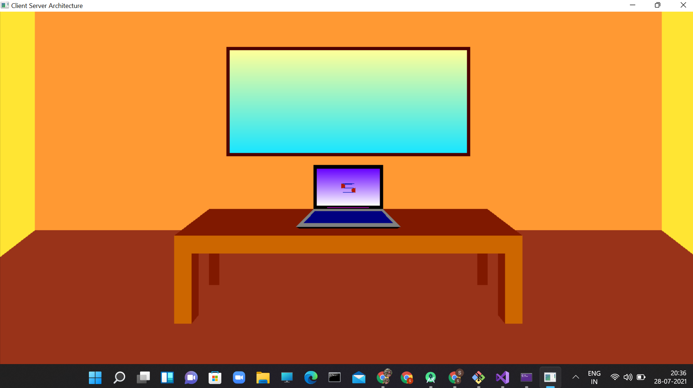
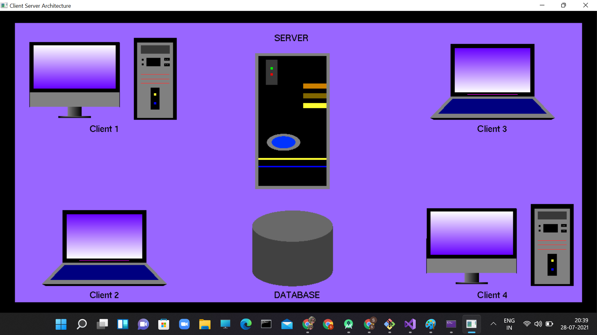
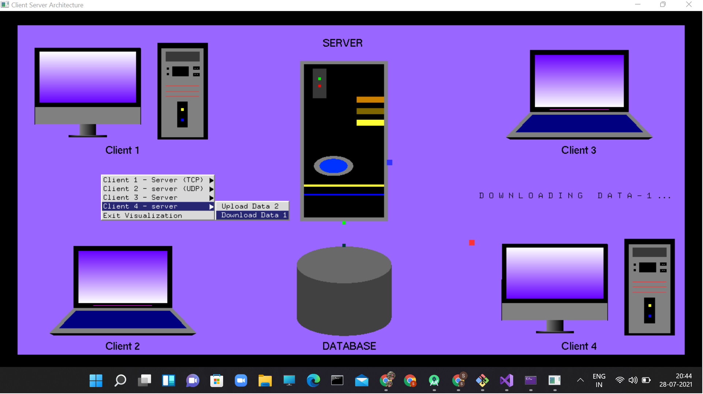
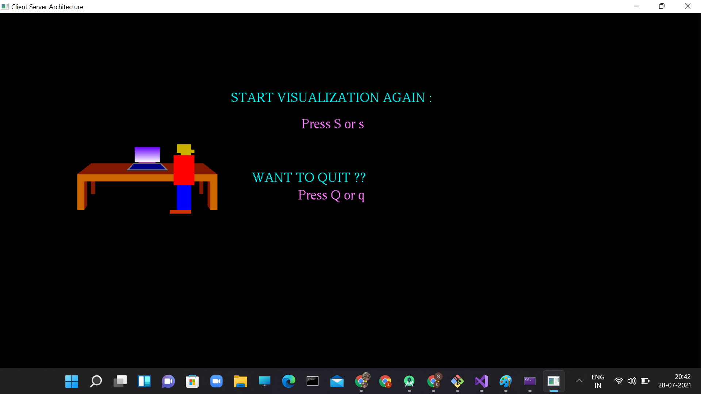

# CGV_PROJECT
## Client Server Architecture :computer: :iphone:
---
* Built using OpenGL with C++

<h2> Overview </h2>  
* Client server architecture Aims to demonstrate the Communication between the client and the server.  
* This project Demonstrates the working of TCP, UDP, uploading and downloading of the data between two clients using Database.  

<h2> ScreenShots </h2>

  
  
 

 

  
  
  

